# Flowchart

Sample


## Basic
A node(default)
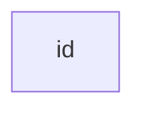

A node with text
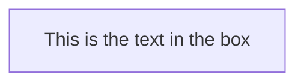

Graph (TB or TD: top to bottom or top to down)
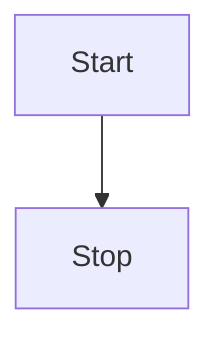

Graph (LR: left to right)
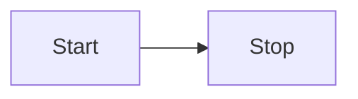

## Node Shapes

A node with round edges
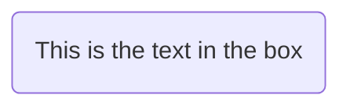

A stadium-shaped node
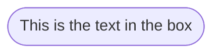

A node in a subroutine shape
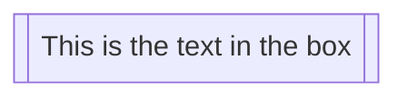

A node in a cylindrical shape
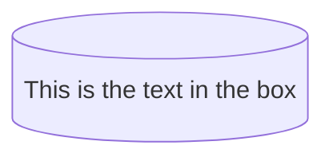

A node in the form of a circle
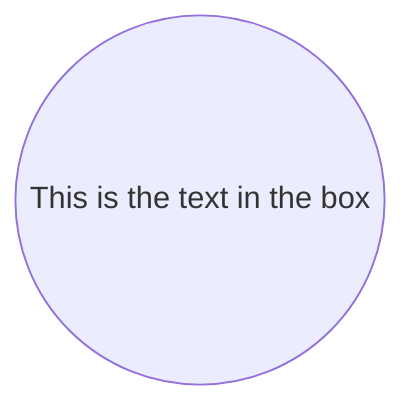

A node in an asymmetric shape
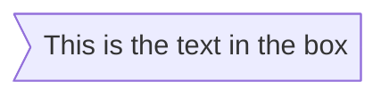

A node (rhombus)
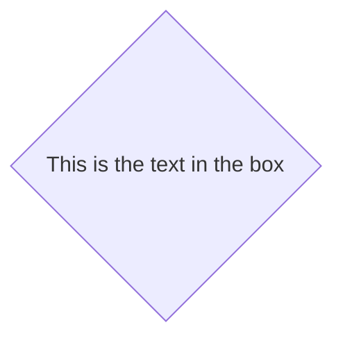

A hexagon node
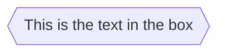

Parallelogram
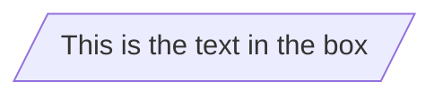

Parallelogram alt
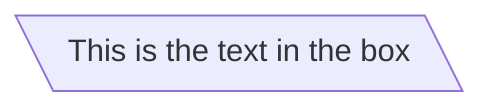

Trapezoid
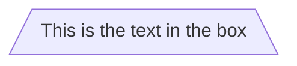

Trapezoid alt
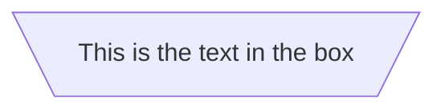

## Links between nodes

A linke with arrow head
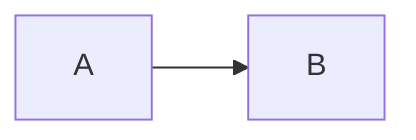

An open link
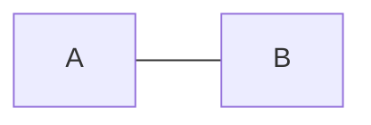

Text on links
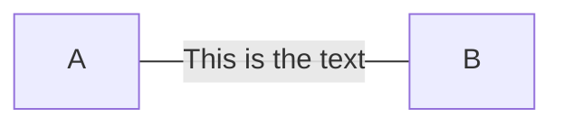

A link with arrow head and text
```mermaid
flowchart LR
    A-->|text|B
```

Dotted link
```mermaid
flowchart LR
    A-.->B
```

Dotted link with text
```mermaid
flowchart LR
    A-.->|text|B
```

Thick link
```mermaid
flowchart LR
    A==>B
```

Thick link with text
```mermaid
flowchart LR
    A==>|text|B
```

Chaning of links
```mermaid
flowchart LR
    A --> B --> C
```
```mermaid
flowchart LR
    A --> B & C --> D
```
```mermaid
flowchart LR
    A & B --> C & D
```

New arrow types
```mermaid
flowchart LR
    A --o B & C --x D
```

Multi directional arrows
```mermaid
flowchart LR
    A o--o B
    B <--> C
    C x--x D
```

Minimum length of link
```mermaid
flowchart TD
    A[Start] --> B{Is it?}
    B -->|Yes| C[OK]
    C --> D[Rethink]
    D --> B
    B ---->|No| E[End]
```
# Sequence diagram

```mermaid
sequenceDiagram
    participant Alice
    participant Bob
    Alice->>John: Hello John, how are you?
    loop Healthcheck
        John->>John: Fight against hypochondria
    end
    Note right of John: Rational thoughts <br/>prevail!
    John-->>Alice: Great!
    John->>Bob: How about you?
    Bob-->>John: Jolly good!
```

# Gantt diagram

```mermaid
gantt
dateFormat  YYYY-MM-DD
title Adding GANTT diagram to mermaid
excludes weekdays 2014-01-10

section A section
Completed task            :done,    des1, 2014-01-06,2014-01-08
Active task               :active,  des2, 2014-01-09, 3d
Future task               :         des3, after des2, 5d
Future task2               :         des4, after des3, 5d
```

# Class diagram

```mermaid
classDiagram
Class01 <|-- AveryLongClass : Cool
Class03 *-- Class04
Class05 o-- Class06
Class07 .. Class08
Class09 --> C2 : Where am i?
Class09 --* C3
Class09 --|> Class07
Class07 : equals()
Class07 : Object[] elementData
Class01 : size()
Class01 : int chimp
Class01 : int gorilla
Class08 <--> C2: Cool label
```

# Pie chart diagrams

```mermaid
pie title Pets adopted by volunteers
    "Dogs" : 386
    "Cats" : 85
    "Rats" : 15
```